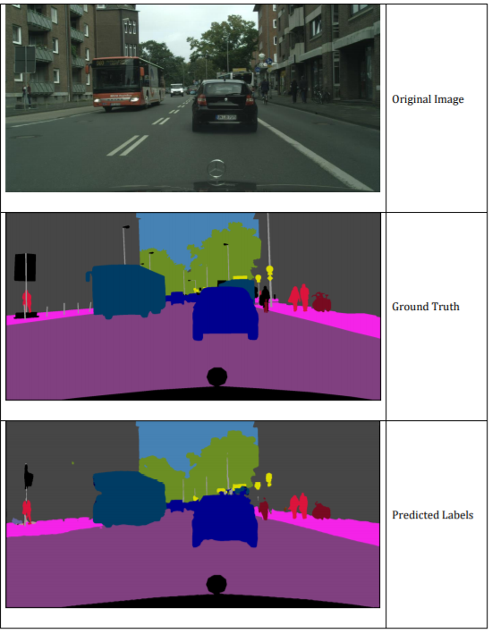

# U-Net Semantic Segmentation on CamVid Dataset

  

This repository implements semantic segmentation using the U-Net architecture on the CamVid dataset. It provides pixel-level classification for images, showcasing U-Net's ability to perform efficient and accurate segmentation in real-world scenarios. The project includes training scripts, pre-processing pipelines, and visualization of segmentation results.

## Table of Contents

- [Introduction](#introduction)
- [Dataset](#dataset)
- [Model Architecture](#model-architecture)

## Introduction

Semantic segmentation involves classifying each pixel in an image into a predefined class. This project utilizes the U-Net architecture to perform semantic segmentation on the CamVid dataset, which consists of road/driving scene images.

## Dataset

The [CamVid (Cambridge-driving Labeled Video Database)](http://mi.eng.cam.ac.uk/research/projects/VideoRec/CamVid/) is a road/driving scene understanding database captured at 960×720 resolution. It provides ground truth labels associating each pixel with one of 32 semantic classes.

For this project, the dataset is preprocessed to focus on 11 primary classes, combining several similar classes for more effective segmentation.

## Model Architecture

The U-Net architecture consists of a contracting path (encoder) and an expansive path (decoder), with skip connections between corresponding layers. This design allows the network to capture both contextual and localization information effectively.

